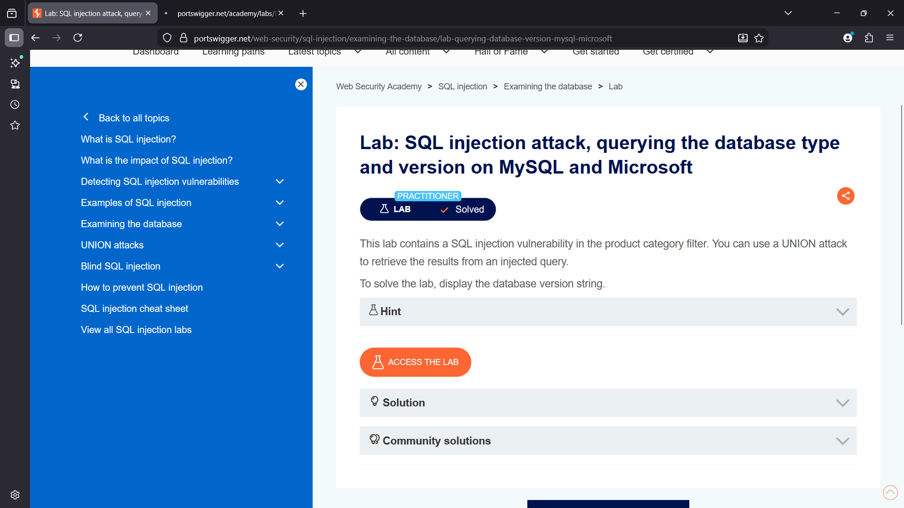
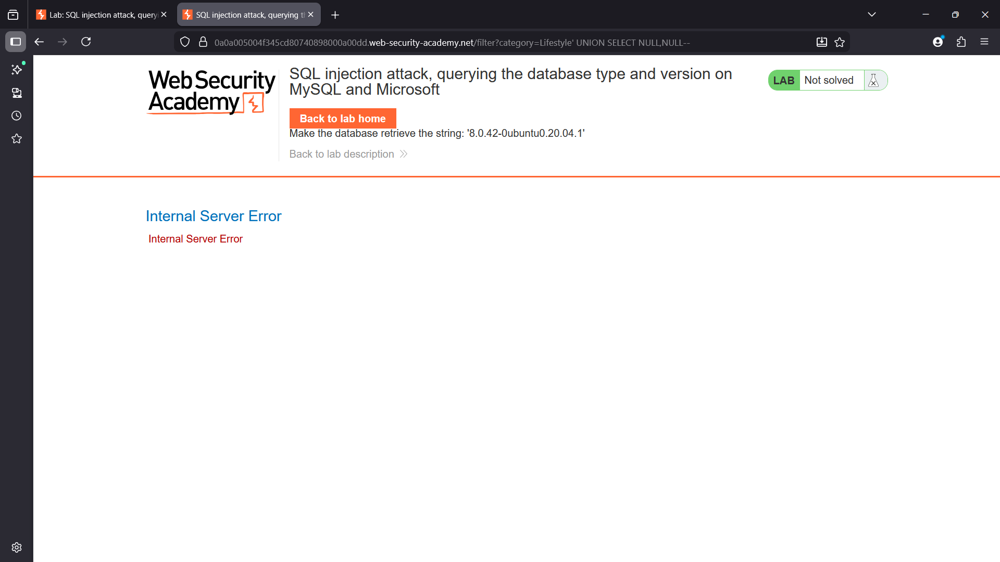
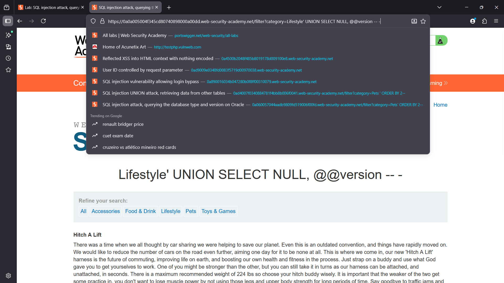
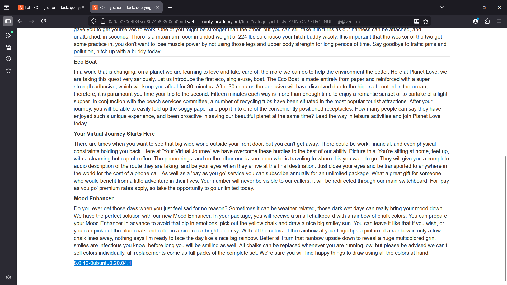
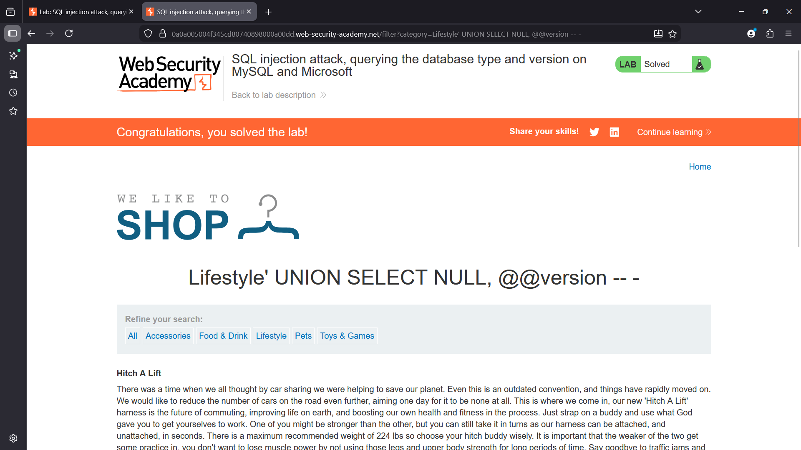

# SQL Injection Attack – Querying Database Type and Version on MySQL & Microsoft SQL Server

## Overview

This lab demonstrates a **SQL Injection vulnerability** in the product category filter parameter.

The application constructs SQL queries using user-supplied input without proper sanitization. Because the query results are reflected in the response, attackers can exploit the vulnerability using a **UNION-based SQL injection**.

The objective of the lab is to retrieve the **database version string** from a MySQL or Microsoft SQL Server database.

---

## Enumeration

Initial testing revealed that the `category` parameter is used directly in the backend SQL query.

## Example request

/filter?category=Lifestyle

To determine the number of columns returned by the query, the **ORDER BY technique** was used.

Example payload:

```sql
' ORDER BY 2 -- -
```
The application responded normally, confirming that the original query returns two columns.

---

### Vulnerability

The application fails to sanitize the `category` parameter before including it in the SQL query.

Because user input is directly concatenated into the query, attackers can inject arbitrary SQL commands.

This allows an attacker to perform UNION-based SQL injection attacks to retrieve data from the database.

---

### Exploitation

In MySQL and Microsoft SQL Server, database version information can be retrieved using the global variable:

```
@@version
```
---

### Payload Used

```sql
' UNION SELECT NULL, @@version -- -
```
---

### Explanation

. `@@version` returns the database server version information

. `UNION` SELECT merges attacker-controlled results with the application's query

. `NULL` is used to match the number of columns returned by the original query

. After executing the payload, the database returns the server version string.

---

## Example output:

```
8.0.42-Ubuntu0.20.04.1
```
This confirms the backend database version.

---

## Database Differences: Oracle vs MySQL/MSSQL

One important aspect of SQL injection exploitation is understanding that different database engines use different syntax and system tables.

Oracle

Oracle databases store version information in a system view.

Example payload:
``` sql
' UNION SELECT banner, NULL FROM v$version --
```

Explanation:

. `v$version` is a system view containing Oracle database version information

. `banner` contains the readable version string

---

MySQL / Microsoft SQL Server

MySQL and MSSQL expose version information using a system variable instead of a system table.

Example payload:
```sql
' UNION SELECT NULL, @@version --
```

Explanation:

. `@@version` directly returns the database server version string 

---

## Key Difference

|Database | Method Used	| Example Payload|
|---------|-------------|--------------|
|Oracle	  |System View	|`SELECT banner FROM v$version`|
|MySQL	  |System Variable | `SELECT @@version`|
|MSSQL	  |System Variable | `SELECT @@version`|

Understanding these differences is essential during database fingerprinting in penetration testing.

---

### Impact

. Successful SQL injection exploitation allows attackers to:

. Identify the database engine

. Retrieve database version information

. Perform database fingerprinting

. Launch further database-specific attacks

. Extract sensitive information from the backend database

Database version disclosure helps attackers identify known vulnerabilities in specific database versions.

---

## Remediation

. To prevent SQL injection vulnerabilities, the application should:

> Use parameterized queries (prepared statements)

. Avoid concatenating user input directly into SQL queries

. Implement strict input validation

. Use ORM frameworks that automatically handle query construction safely

Apply least privilege access control for database accounts

---
## SCREENSHOTS

# lab overview


## cloumn count


### payload injection


### data extarction


## Lab sloved 
