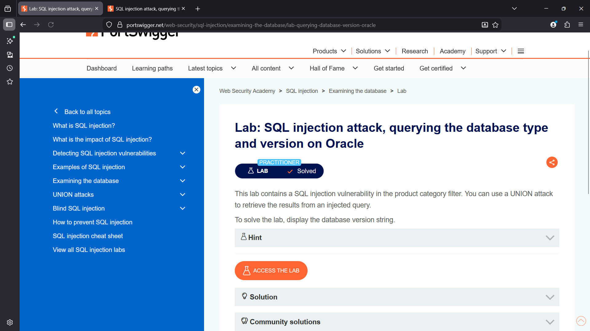
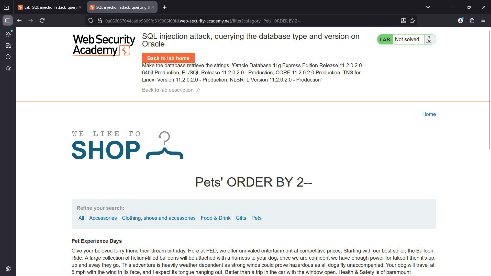
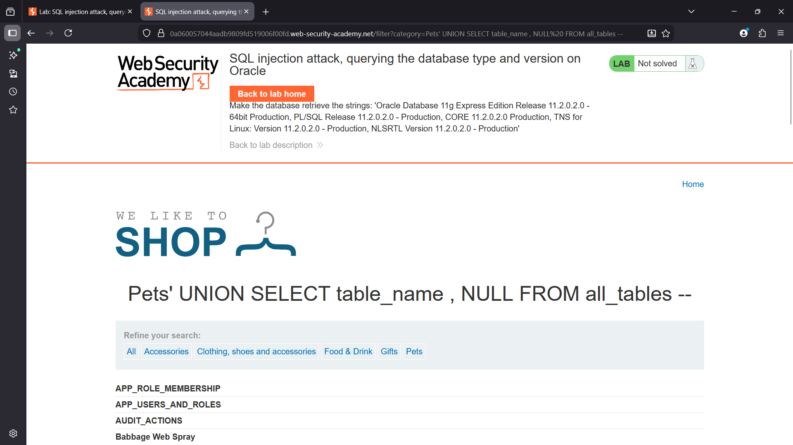
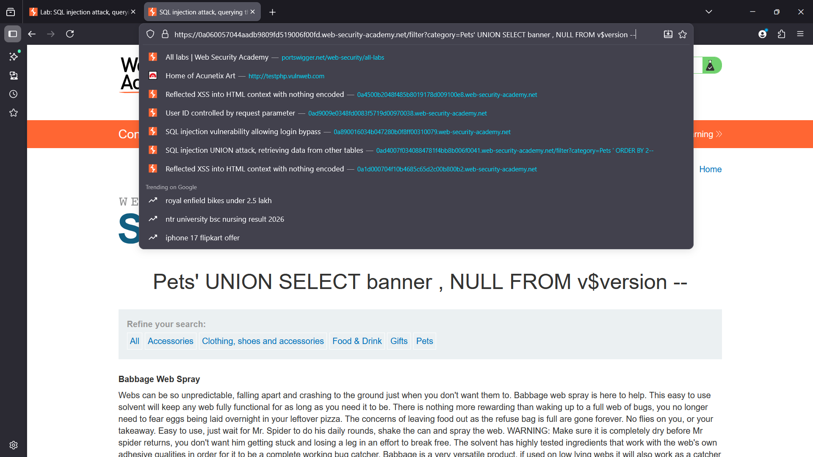
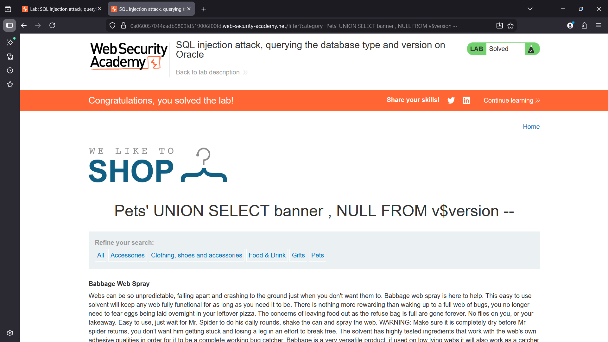

# SQL Injection Attack – Querying Database Type and Version on Oracle

## Overview

This lab demonstrates a **SQL Injection vulnerability** in the product category filter parameter.

The application constructs SQL queries using user-supplied input without proper sanitization. Because the query results are reflected in the response, it is possible to perform a **UNION-based SQL injection** to retrieve information from the database.

The goal of the lab is to extract the **database version information** from an Oracle database.

---

## Enumeration

Initial testing showed that the `category` parameter is included directly in a backend SQL query.

Example request:

/filter?category=Pets

Testing SQL injection using the **ORDER BY** technique helped determine the number of columns returned by the query.

Example payload:

```sql
' ORDER BY 2 --
```

The page responded normally, confirming that the query contains two columns.

---

## VULNERABILITY :

The application fails to properly sanitize user input in the category parameter.

Because the input is directly concatenated into the SQL query, attackers can inject arbitrary SQL commands.

This vulnerability allows attackers to perform UNION-based SQL injection attacks to retrieve information from database system tables.

---

## EXPLOITATION :

Since the backend database is Oracle, the system version information can be retrieved from the v$version view.

## Payload Used

```sql
' UNION SELECT banner, NULL FROM v$version --
```
---

## Explanation:

. banner contains the database version information

. v$version is an Oracle system view containing version details

. UNION SELECT allows the injected query results to be combined with the application's original query

. NULL is used to match the number of columns in the original query

. When executed, the database returns the full Oracle version string.

---

## Impact:

. Successful exploitation allows attackers to:

. Identify the database type

. Extract the database version

. Perform further database enumeration

. Plan advanced database-specific attacks

. Database fingerprinting is often the first step in deeper SQL injection exploitation.

---

## Remediation:

. To prevent SQL injection vulnerabilities, the application should:

. Use parameterized queries (prepared statements)

. Avoid concatenating user input directly into SQL queries

. Implement input validation and sanitization

. Apply least privilege database access

. Use ORM frameworks that safely construct queries

---

## Screenshots:

### Lab Overview


### Cloumn Count discovery 


### SQL Payload  


### Data extracation


### Lab sloved

