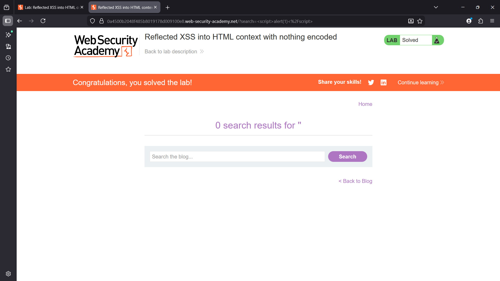
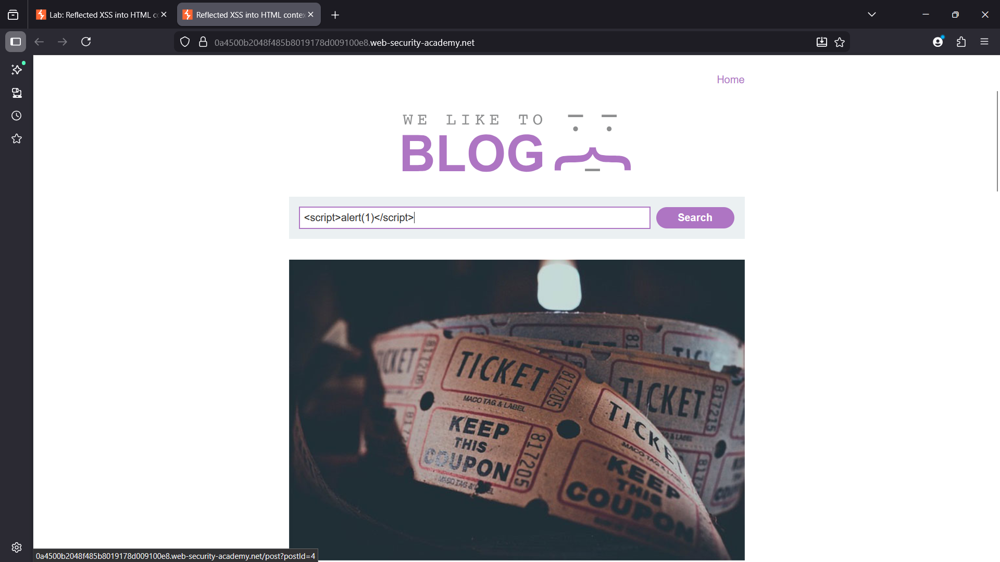
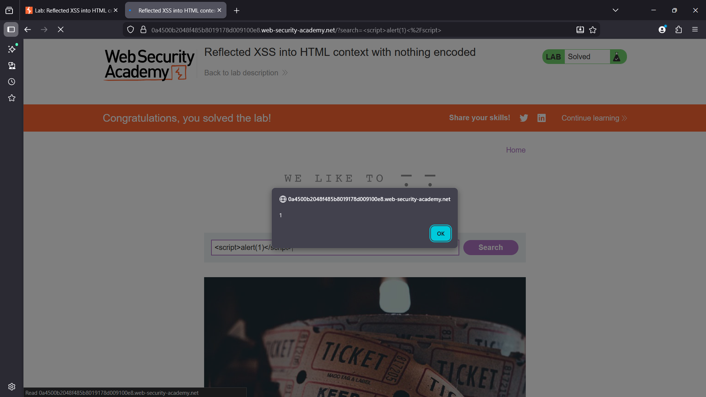
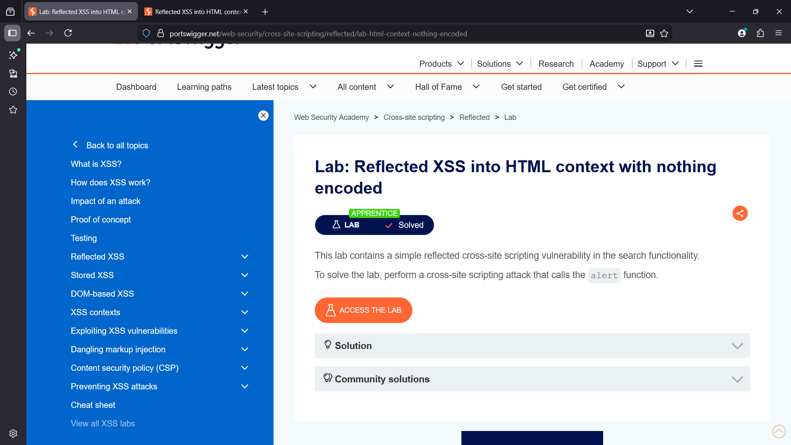

# Reflected XSS into HTML Context with Nothing Encoded

## Overview
This lab demonstrates a **Reflected Cross-Site Scripting (XSS)** vulnerability in the application's search functionality.  
User-supplied input is reflected directly into the HTML response without any sanitization or encoding.

Because the input is inserted into the page as raw HTML, an attacker can inject malicious JavaScript that will execute in the victim’s browser.


## Enumeration
The search functionality was tested to determine whether user input is reflected in the response.

A test search request was submitted:

```
/?search=test
```

The application reflected the value of the `search` parameter directly in the HTML page.  
This behavior indicates that user input is being processed without proper encoding.




## Vulnerability
The application embeds user input directly inside the HTML response without escaping special characters.

Because of this behavior, it is possible to inject JavaScript code that the browser will execute when the page loads.

This results in a **Reflected Cross-Site Scripting (XSS)** vulnerability.


---

## Exploitation

### Payload Used

```
<script>alert(1)</script>
```

### Steps

1. Enter the payload into the search field.
2. Submit the request.
3. The payload is reflected in the HTML response.
4. The browser interprets the payload as executable JavaScript.

The alert box confirms that the injected script executed successfully.





---

## Impact
A reflected XSS vulnerability can allow attackers to execute arbitrary JavaScript in a victim’s browser.

Possible consequences include:

- Stealing session cookies
- Hijacking authenticated sessions
- Delivering phishing content
- Performing actions on behalf of the victim

---

## Remediation
To prevent reflected XSS vulnerabilities, the application should implement the following controls:

- Proper **HTML output encoding** of user input
- Strict **input validation**
- Use of secure templating frameworks that escape user input automatically
- Implementing **Content Security Policy (CSP)**

---

## Screenshots

### Lab Overview


### Payload Injection


### Exploit Execution


#### Lab sloved


