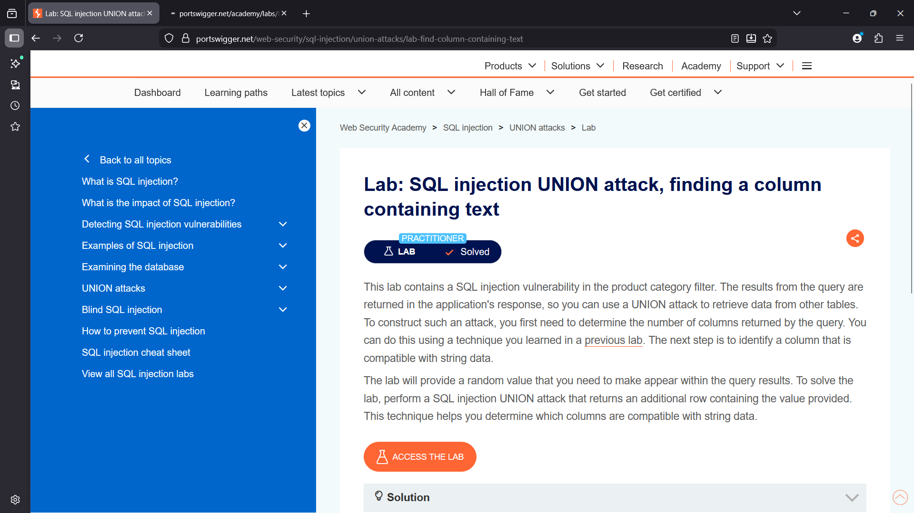
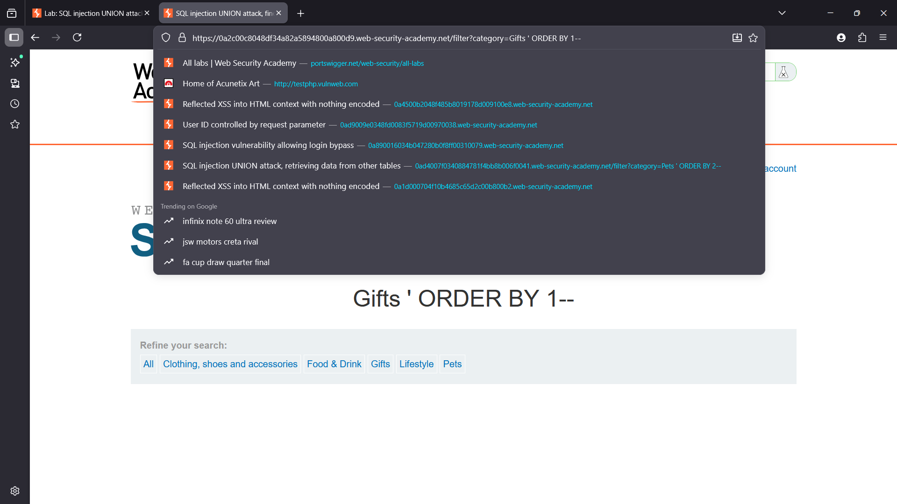
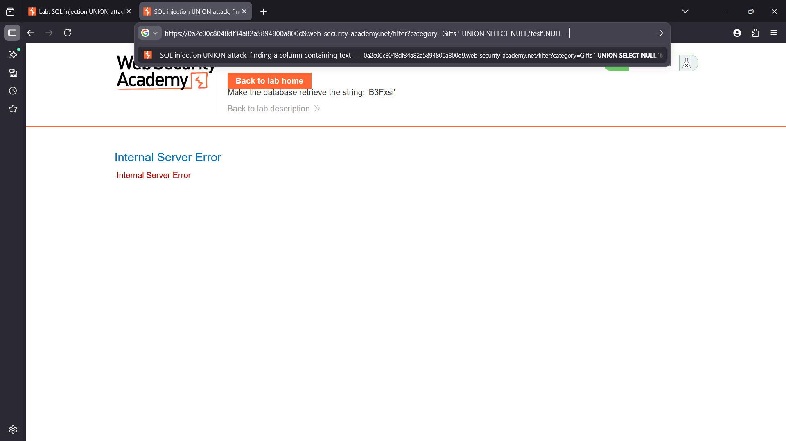
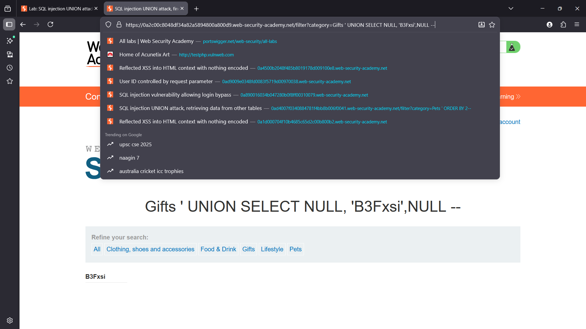
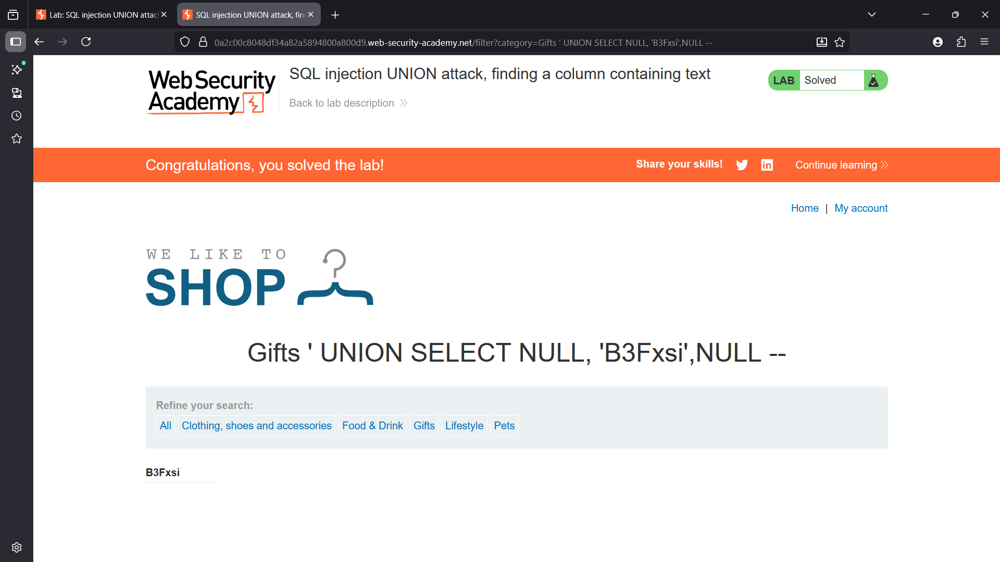

# SQL Injection UNION Attack – Finding a Column Containing Text

## Overview

This lab demonstrates a **SQL Injection vulnerability** in the product category filter of a shopping application.

The application executes a SQL query using the `category` parameter without proper sanitization. Because the query results are reflected in the response, it is possible to exploit the vulnerability using a **UNION-based SQL injection** to retrieve additional data from the database.

---

## Enumeration

Initial testing showed that the `category` parameter is directly included in the SQL query.

Example request:

```
/filter?category=Gifts
```

To determine the number of columns returned by the query, the `ORDER BY` technique was used.

Example payload:

```sql
' ORDER BY 1--
```

Increasing the number allows identification of the total number of columns in the query.

```sql
' ORDER BY 2--
```

When a higher number is used than the query supports, the application returns an **Internal Server Error**, indicating the column count limit.

---

## Vulnerability

The application fails to properly sanitize user input in the `category` parameter.

This allows attackers to inject arbitrary SQL code into the database query.

By using a **UNION SELECT** statement, it is possible to combine the original query with attacker-controlled queries and retrieve additional data.

---

## Exploitation

### Payload Used

```sql
' UNION SELECT NULL,'test',NULL --
```

### Steps

1. Identify the number of columns returned by the query using `ORDER BY`.
2. Construct a UNION query with the same number of columns.
3. Insert a test string into each column to determine which column accepts text.
4. When the text appears in the page response, that column is confirmed to support string data.

Example payload:

```sql
' UNION SELECT NULL,'B3Fxsi',NULL --
```

The value **B3Fxsi** appears in the page output, confirming successful SQL injection.

---

## Impact

A successful SQL injection vulnerability allows attackers to:

- Extract sensitive data from the database
- Bypass authentication mechanisms
- Modify or delete database records
- Execute arbitrary database queries

This can lead to complete compromise of the application’s backend database.

---

## Remediation

To prevent SQL injection vulnerabilities, the application should implement the following controls:

- Use **parameterized queries (prepared statements)**
- Implement **input validation and sanitization**
- Use **ORM frameworks** that safely construct SQL queries
- Apply **least privilege database permissions**

---

## Screenshots

### Lab Overview


### Column Enumeration using ORDER BY


### Internal Server Error when exceeding column count


### UNION Injection Payload


### Successful SQL Injection

