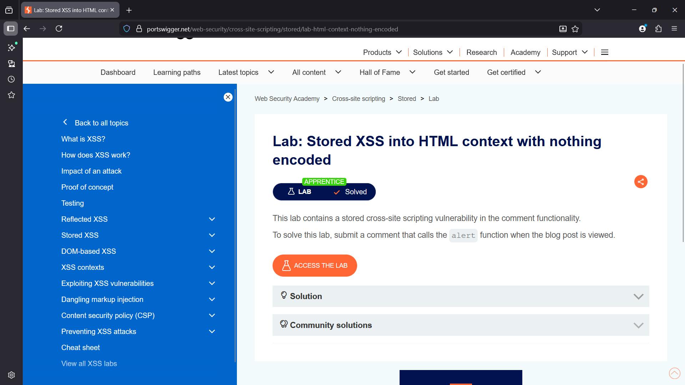
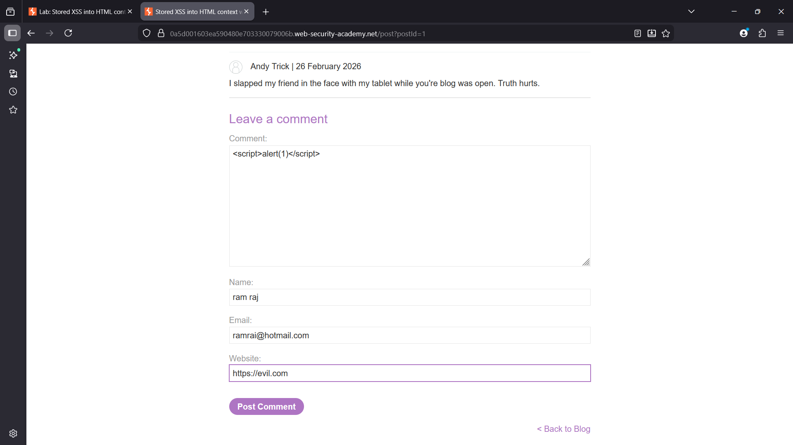
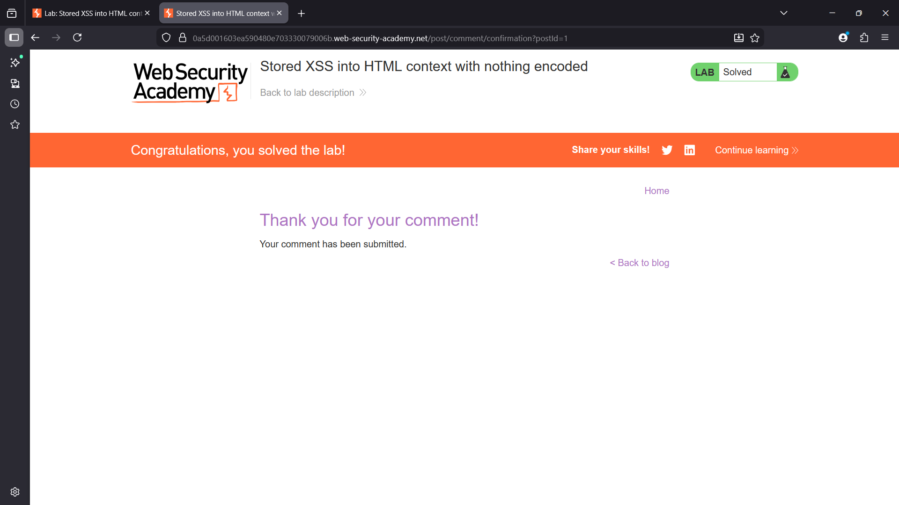

# Stored XSS into HTML Context with Nothing Encoded

## Overview

This lab demonstrates a **Stored Cross-Site Scripting (Stored XSS)** vulnerability in the comment functionality of a blog application.

User input submitted through the comment form is stored by the server and later displayed on the blog page without proper sanitization or encoding. Because the application renders the stored input directly in the HTML response, an attacker can inject malicious JavaScript that executes when the page is viewed.

---

## Enumeration

The blog application allows users to leave comments on posts using a comment form that contains the following fields:

- Comment
- Name
- Email
- Website

Testing the comment field revealed that user input is accepted and displayed on the page without filtering. This behavior suggests the possibility of injecting malicious scripts.

---

## Vulnerability

The application stores user input from the comment form and renders it in the HTML response without escaping special characters.

Because the input is stored on the server and executed when the blog page loads, attackers can inject JavaScript payloads that will run in the browsers of users viewing the page.

This results in a **Stored Cross-Site Scripting (Stored XSS)** vulnerability.

---

## Exploitation

### Payload Used

```html
<script>alert(1)</script>
```

### Steps

1. Navigate to the blog post.
2. Enter the XSS payload in the **Comment** field.
3. Fill the required fields such as Name and Email.
4. Submit the comment.
5. When the blog page loads, the stored payload executes automatically.

This confirms that the application is vulnerable to stored cross-site scripting.

---

## Impact

Stored XSS vulnerabilities are particularly dangerous because the malicious payload is saved on the server and executed whenever the affected page is viewed.

An attacker could exploit this vulnerability to:

- Steal session cookies
- Hijack user sessions
- Perform phishing attacks
- Execute malicious scripts in the victim's browser

---

## Remediation

To prevent stored XSS vulnerabilities, the application should implement the following controls:

- Proper **HTML output encoding** of user input
- Strict **input validation**
- Use secure templating frameworks that escape user input automatically
- Implement **Content Security Policy (CSP)**

---

## Screenshots

### Lab Overview


### Payload Injection


### Comment Submission

